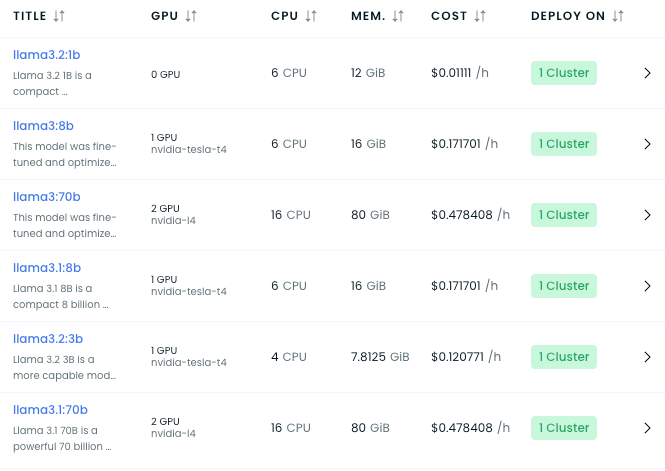
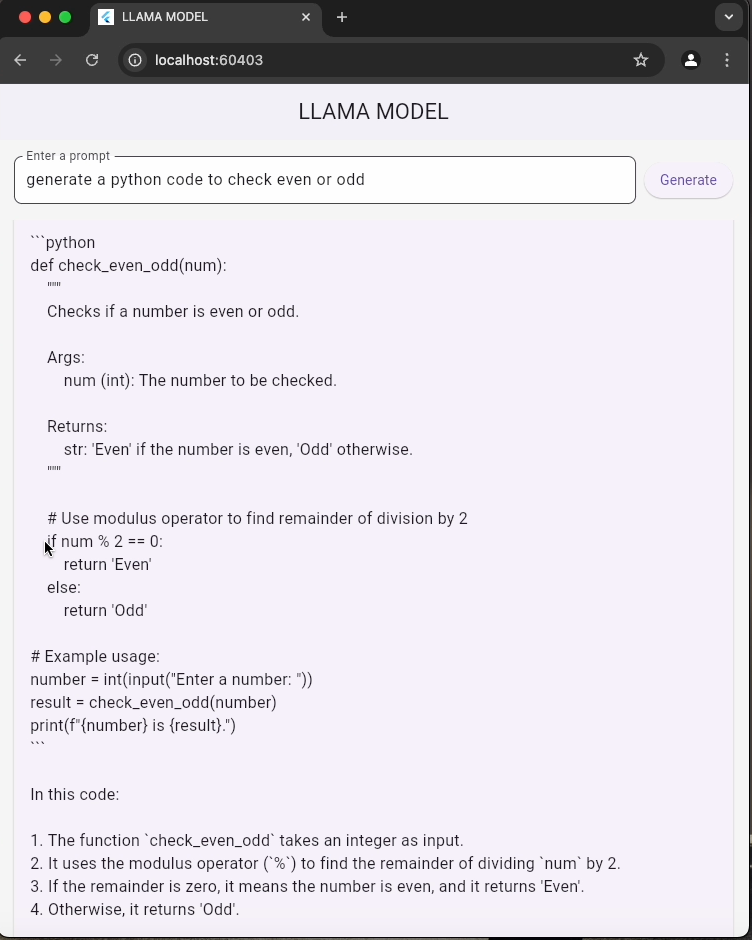

# Llama LLM Kubernetes Deployment with NGINX Ingress

This repository provides instructions for deploying the **Llama3.2:3b** Large Language Model (LLM) on a Kubernetes cluster, using NGINX Ingress Controller to expose the service externally.

---


## Prerequisites

1. **Kubernetes Cluster**: Ensure a Kubernetes cluster is up and running.

---

## Steps for Deployment

### 1. Install NGINX Ingress Controller

To enable external access, install the NGINX Ingress Controller using the following command:
```bash
kubectl apply -f https://raw.githubusercontent.com/kubernetes/ingress-nginx/controller-v1.12.0/deploy/static/provider/aws/deploy.yaml
```

Verify that the Ingress Controller pods are running:
```bash
kubectl get pods -n ingress-nginx
```

---

### 2. Deploy the LLM
Clone the Repo and go to `manifest` folder

Use the `deploy.yaml` file in the `manifest` folder to deploy the model. Update the model name if required by modifying the `containers` section as shown below:

```yaml
containers:
  - name: ollama
    image: ollama/ollama:0.3.12
    imagePullPolicy: IfNotPresent
    lifecycle:
      postStart:
        exec:
          command:
            - ollama
            - run
            - llama3.2:3b
```

To deploy the model:
```bash
kubectl apply -f manifest/deploy.yaml
```

---

### 3. Configure External Access

After deploying the model, use the `ingress-llama.yaml` file to expose the service externally. Update the `host` field with your custom domain and ensure your domain points to the load balancer created by the Ingress Controller.

#### Example `ingress-llama.yaml`

```yaml
apiVersion: networking.k8s.io/v1
kind: Ingress
metadata:
  name: ingress-nginx
spec:
  rules:
    - host: llama.devopsfor.cloud
      http:
        paths:
          - path: /
            pathType: Prefix
            backend:
              service:
                name: service-llama3-2-3b
                port:
                  number: 11434
  ingressClassName: nginx
```

To apply the ingress configuration:
```bash
kubectl apply -f manifest/ingress-llama.yaml
```

Verify that the Ingress resource is created:
```bash
kubectl get ingress
```

---

## Testing the Deployment

Once the domain is configured, the API will be accessible at your domain (e.g., `http://llama.devopsfor.cloud`).

### Example API Request

Send a POST request to interact with the model:

```bash
curl -X POST http://llama.devopsfor.cloud/api/chat \
-H "Content-Type: application/json" \
-d '{
  "model": "llama3.2:3b",
  "stream": false,
  "messages": [
    {"role": "user", "content": "What is Kubernetes?"}
  ]
}'
```
Flutter Example for Testing the Model




Here is the POST request used to interact with the model from a Flutter application:
```
final url = Uri.parse('http://llama.devopsfor.cloud/api/chat');
final response = await http.post(
url,
headers: {'Content-Type': 'application/json'},
body: jsonEncode({
"model": "llama3.2:3b",
"stream": false,
"messages": [
{"role": "user", "content": prompt}
]
}),
);
```
This code sends a POST request to the LLM endpoint and retrieves the generated response. You can integrate this into your Flutter app to test the deployed model.
### Example API Response

```json
{
  "message": {
    "content": "Kubernetes is an open-source platform for automating deployment, scaling, and management of containerized applications."
  }
}
```

---

## Updating the Model

To deploy a different model, update the `containers` section in `deploy.yaml` with the desired model name:
```yaml
command:
  - ollama
  - run
  - <MODEL_NAME>
```

Reapply the updated deployment:
```bash
kubectl apply -f manifest/deploy.yaml
```

---
